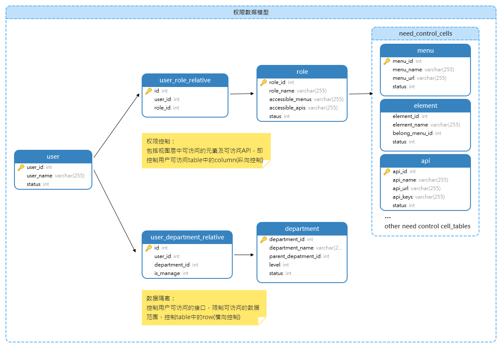

# 问题概述
## 早期的RBAC模型
我们在设计构建一个软件系统的时候，往往伴随着业务系统中用户的不同分类而需要赋予其各自不同的视图(view)的访问权限、view中元素的访问权限，功能(func)的使用权限。  
这就是目前早已成熟已久的RBAC模型，RBAC（Role-Based Access Control）是一种基于角色的访问控制模型，在RBAC模型中，角色是一组权限和操作的集合，用户被授权访问资源时，会被分配到一个或多个角色。这些角色定义了用户可以执行的操作和访问的资源。通过将权限分配给角色，可以更容易地管理和控制访问权限，同时也可以更容易地进行审计和监控。  
随着IT行业的发展，RBAC模型使用中也暴露一些弊端：  
- 角色数量过多关系复杂，在比较复杂的业务系统中（整个组织的业务深度依赖系统），这种大型的业务系统中可能需要定义大量的角色，角色之间同时关系复杂，组织中每个部门各自角色不一样，运营维护角色数据的工作变的困难。
- 颗粒度不够，RBAC将view和func作为系统资源抽象到一个角色属性下，但是对于角色内部，如何控制角色之间的数据隔离和访问控制也是一个问题。RBAC模型无法对资源的细粒度访问进行控制，例如，无法对具体数据对象进行访问控制，只能对整个视图或功能进行控制，这在某些情况下可能会导致数据泄露或安全漏洞。（尤其是面对部门内成员既是合作者又是竞争者的，如目前各种面向销售的CRM系统，销售部门内部既是合作者又是重要的竞争者），不管是竞争需要又或者公司决策者出于对系统数据的安全考虑，RBAC解决不了需求。
- 难以应对动态变化的需求，RBAC模型是一种静态的访问控制模型，无法应对动态变化的需求。例如，当系统需要添加新的角色或权限时，需要手动修改和更新RBAC模型，这会导致系统的维护成本和风险增加。  
## 需求描述
1. 实现组织内部用户视图权限和func权限的控制。
2. 实现组织内部用户数据隔离。
3. 动态管理用户权限。
4. 支持多级授权，组织结构中是一个树的关系，上层节点的授权改动需要直接影响下层节点组织。
5. 支持角色的继承和组合：可以使用属性和策略来定义角色的继承和组合关系，从而实现更灵活的访问控制。  
...

# 解决方案（基于关系型数据库）

## 视图层的功能权限
### 第一步：明确要在视图中实现权限控制的目标，一般而言主要为以下目标：  
- 需要授权用户访问系统中的menu  
- 需要授权用户访问界面中button（事件绑定）
- 需要授权用户访问的URL(这里要注意的是，对于使用restful思路进行设计的API，由于增删改查都是基于method的不同，所以需要额外的标识。)
- 非restful风格api:

    URL:  /adduser、/delteteuser 、/getuser、/updateuser，对于某功能需要细分增删改查权限的，这种风格的设计从URL天然就可以支持。  
    example:    
    `{user_name:"zhangsan",
    role:"sale",
    access_menu:[menu1,menu2],
    access_element:[element1,element2],
    access_api:[adduser,updateuser,getuser,deleteuser]
    }`

- restful风格的,依赖HTTP的不同方法来对资源进行管理，可以在每个URL增加权限标识：如  
URL：/user
method: post,get,put,delete...  
example:  
`{user_name:"zhangsan",
 role:"sale",
 access_menu:[menu1,menu2],
 access_element:[element1,element2],
 access_api:{url1:[read,write,delete],url2:[read],url3:[read,write]}
}`

### 第二步：初始化资源数据
初始化需要控制的资源表，menu、elements、api，分配唯一标识符，建立映射关系。  

### 第三步：建立用户组表（即角色role）  
1. 用户与角色是多对多的关系，一个用户对应多个角色，一个角色对应多个用户，单独新增一个userl_role_relateive表，存储这种多对多的关系。  
2. 用户组权限分配，role表存储每个用户组与资源之间的关系，这个分配过程需要一个界面使得管理员可以更方便的配置和更新每个用户组拥有的权限内容。  

### 第四步：授权检查  
访问系统资源API时，进行权限检查，即遍历该用户的所有用户组的accessible_apis，求并集。检查目前访问的URL是否在该并集中，否则需要提示“非授权访问”，也可以对这种非授权场景进行后续惩罚措施：如五次非授权请求即封停账号等。  

## 数据层的数据隔离  
数据隔离对table中的数据横向的切片，对于用户访问系统数据，部分用户只能部分数据，部分用户可以访问所有数据，但都需要访问这种表的数据。  
业务上来讲，对于系统安全要求较高的项目，业务领导希望整体上的数据不能够从内部被泄露，从内部形成数据隔离，或者是销售客户表等容易引起“数据竞争”需要设置数据隔离。  
由于这种隔离往往是基于用户身份，比如同级别的销售A和销售B不能看到彼此数据，而销售的管理员，或者更高级别的领导却能看到所有数据...  

第一步：  
1. 明确哪些功能需要进行权限隔离。  
2. 数据在创建时记录数据的创建人。  
3. 维护一份组织架构表。  
4. 根据组织架构表的的树结构关系决定当前用户能够访问的数据范围，在树的更高节点用户访问的数据不仅是其自身，也包含了下游节点的所有用户产生的数据、下游的下游...

```
set @user_input #获取前端传入变量userid
#深度or广度遍历该user当前部门节点下下所有user
set @userlist
#查询所有用户
select * from process_decode where operater_user in @userlist #获取解码指令列表 
```


